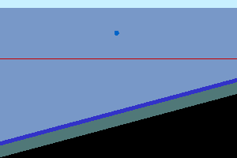

# SeidarT

Seismic and radar modeling using staggered grid finite differences (FDTD) and convolutional perfectly matched boundaries (CPML)

### Table of Contents
[Introduction](#introduction)  
[Installation](#install)  
[Getting Started](#getting_started)  
[Routines](#routines)  
[Examples](#examples)  
[Appendix](#appendix)  
[References](#references)  

[comment]: ======================================================================

## Introduction 

The Seismic and Radar Toolbox (SeidarT) is a collaboration between researchers at the Universities of Maine and Washington to provide an open source platform for forward modeling mechanical and electromagnetic wave propagation. The major objective of the project is to easily and quickly implement isotropic and anisotropic complex geometries and/or velocity structures to develop prior constraints for - not limited too - investigating, estimating, and imaging englacial ice structure, sub-glacial boundary conditions on the sub-regional scale. Larger problems would require the curvature of the Earth to be taken into consideration, but many glacier seismic and radar experiments do not expand into regional parameter estimation and velocity modeling. 

Much of this code has been adopted from the *SEISMIC_CPML* software provided by [Computational Infrastucture for Geophysics (CIG)](https://geodynamics.org/cig/software/). Further details to the backend numerical code can be found in the [References](#references) section below.

[comment]: ======================================================================
## Installation 

The dynamical programming language of **Python3** is used as a front end to run the more computationally extensive modeling schemes in **Fortran**. The following system dependencies are required:

**Python3, Fortran95, GCC, pip, git, ghostscript, imageMagick**

and additionally, the **Python** dependencies: *numpy*, *scipy*, *glob3*, *matplotlib*, *mplstereonet* (optional for viewing fabric distributions). This can be done via **apt** with 
~~~
sudo apt update
sudo apt upgrade
pip3 install numpy matplotlib scipy glob mplstereonet
~~~

and with homebrew using the command 

~~~
brew update
brew upgrade
pip3 install numpy matplotlib scipy glob3 mplstereonet
~~~

Installation of these packages is different between MacOSx and Linux distributions. [*Anaconda*](https://docs.continuum.io/anaconda/) provides a convenient **Python** environment for installing and developing programs, however, Anaconda doesn't provide *GCC-7* or later so compilation of the **Fortran** code will return an error. This can be remedied by uninstalling **GCC** from *Anaconda* and upgrading via *apt* to *GCC-7* or greater. For *Anaconda* users, it might be necessary to install via **conda** and **pip**.

To download the software, open a terminal (*Ctrl-Alt-t* for Ubuntu and *Ctrl-Opt-Shift-t* for Mac) and change directories

~~~
cd /path/to/parent/directory
~~~

to where you would like SeidarT to be located then clone the files from *github* 

~~~
git clone git@github.com:sbernsen/SeidarT.git
~~~

This will create a folder named **SeidarT** that contains all executables and modules. Change directories to the **SeidarT** folder

~~~
cd SeidarT
~~~

and run the install file

~~~
bash install.sh
~~~

When the compilation is finished, we can add the folder to the path directory and the python path directory. Currently, this software is supported with **bash** so append the following lines to the *.bashrc* if using Ubuntu 

~~~
export PATH=$PATH:/path/to/SeidarT/bin

export PYTHONPATH=$PYTHONPATH:/path/to/SeidarT/bin
~~~

and if Python 2 is the default version create an alias in the *.bashrc* file by adding the line in the alias section

~~~
alias python=python3
~~~

Depending on the OS release (El Capitan, High Sierra, Mojave, etc.) and whether you have *Anaconda* installed appending a path might be different. Anaconda may set aliases so troubleshooting on a Mac can be cumbersome. Before editing the */etc/path*, *.bash_profile*, *.profile* or *.bashrc* file it is a good idea to create a backup especially if you are not familiar with either or any of those files. To do this copy the original to a new name. For example,

~~~
cp <location/of/path/definitions> <location/of/path/definitions>_original
~~~

that way you can always revert back to the working script. 

There are a variety of ways to edit the documents but for simplicity change directories to the home folder 

~~~
cd ~
~~~

and input into the command line

~~~
sudo nano .bashrc
~~~

or 

~~~
sudo nano /etc/paths
~~~

then scroll down to the bottom of the file and append the path. Save and close (*Ctrl-x* then *Y* and enter) the file then check to make sure it is included in the path 

~~~
echo $PATH
echo $PYTHONPATH
~~~

[comment]: ======================================================================

# Getting Started 

Geometries are initiated with a PNG image and the program identifies unique RGB values. Everyone has their preferences to generate images but [*GIMP*](https://www.gimp.org/downloads/install_help.html) and [*Inkscape*](http://wiki.inkscape.org/wiki/index.php/Installing_Inkscape) provide free and open software that are more than sufficient. When creating a PNG anti-aliasing must be turned off to avoid color boundary gradients.  

To get started on a new project create a new folder and save the image to the folder. From the command line, change directories to the project folder then enter into the command line

~~~
prjbuild -i /path/to/geometry/image.png -o project_filename.prj
~~~

The project filename is optional if the -o option is omitted and the default text file *jordan_downs.prj* will be generated. For any of the executables the -h or --help option will provide a quick reference to any positional, optional or required arguments.

Using the text editor of choice, you can edit the .prj file.  

[comment]: ======================================================================

[comment]: ======================================================================

## Routines 

*prjbuild.py*  
constructs a template and assigns default values from a PNG image.  

*prjrun.py*  
reads the project file assigns coefficients given that all the required fields are satisfied then runs the specified 2D forward model. You can suppress modeling and edit the stiffness and/or permittivity and conductivity coefficients. Once they are provided in the project file, they won't be computed or overwritten from the material values. If you would like to change the material values and recompute the tensor coefficients, you need to delete the existing tensor coefficients if included in the project file.  

*im2gif.py*  
Create a gif from the model outputs. Currently, this takes some time to run which you can speed up by increasing the 'write' value in the project file.  

*arrayplot.py*  
Plot the seismograms or radargrams for the wide angle survey. You can suppress plotting which will return a .csv file. A simple exponential gain function can be called and applied to each of the time series.  

*codisplay.py*  
Display the outputs of the common offset survey. This is also called to display the common midpoint survey. Similar to arrayplot.py, the gain function can be called.  

*orientation_tensor.py*  
Compute the Euler angles and orientation tensor for a fabric defined by it's trend and plunge angles. The orientation tensor isn't required by the program but it provides useful quantitative information describing the orientation of the fabric.   

<u>Wrappers</u>

*wide_angle.sh*  
Script to model and display an equally spaced reciever array. If the .dat files are not deleted, any node within the model domain can be called. The time series for the recievers are saved as 'reciever_array.csv'. A default gain is set in the script file but can be varied by editing the appropriate line.  

*common_offset.sh*  
This is a wrapper that shifts the source and queries the respective reciever location over a given distance and assembles the subsequent time series into a common offset image. The reciever trails the source so leave space for the reciever location. The initial source location is given in the corresponding .prj file. During the routine this value is changed each iteration then restored to the original value when it is complete. A default gain is set in the script file but can be varied by editing the appropriate line.  

*common_midpoint.sh*  
This is similar to the common offset survey but it shifts the source and reciever away from a common midpoint. The midpoint is specified by the source location in the project file. By default the source will be to the viewer's right of the midpoint but to flip the location of the source and reciever, set the midpoint x-value to negative. A default gain is set in the script file but can be varied by editing the appropriate line.  

#### *Note: The aspect ratio for the wide angle, common offset and common midpoint surveys determines the axis exaggeration. This will be updated in the future to be easier to adjust but to change this value edit the line 'ax.set_aspect(aspect=??)' in arrayplot.py and codisplay.py then run the plotting scripts individually not the wrapper scripts. 

[comment]: ======================================================================

## Examples 

#### Dipping Bed Model  

*Seismic and Electromagnetic Wavefields*

These are small, simple models to introduce the routines. 

  
After running the install script without errors then adding the program file parent directy to the path, open a terminal and change directories into the EXAMPLES folder. Input into the command line

~~~
prjbuild -i dipping_bed.png -o dipping_bed.prj
~~~

Fill in the missing domain values for 1 meter spacing in both directions and an absorbing boundary of 30 pixels as

>D,dx,1  
>D,dy,n/a  
>D,dz,1  
>D,cpml,30  
>D,write,10  
 
then add the following material values 

>M,0,granite,0/0/0,-5,1,2540,1,10,False,  
>M,1,water,0/100/200,-1,2,1000,0,0,False,  
>M,2,ice1h,50/50/200,-2,3,910,2,30,False,  
>M,3,wet_sand,80/120/120,-2,2,1500,4,40,False,  
>M,4,ice1h,120/152/200,-10,2,910,2,5,False,  
>M,5,basalt,200/0/0,-10,2,1200,0,0,False,  
>M,6,air,200/240/255,0,0,1.3,0,0,False,  

the source parameters for a seismic source just below the surface on the right side of the domain

>S,time_steps,2500
>S,x,280
>S,y,0
>S,z,21
>S,f0,80

and the source parameters for a transverse radar pulse source in the same location as the seismic source except at the surface

>E,time_steps,1600
>E,x,150
>E,y,0
>E,z,20
>E,f0,1e7
>E,theta,90

All lines that start with a '#' are commented lines but without the correct identifiers 'D', 'M', 'S', 'C', 'E', and 'P' the line will not be read by the computer so it is possible to make notes in the project file. If in doubt, and for good habit, use a hashtag.

For reference, you can use the RGB values to identify the materials so it is important to keep track of these when creating a geometry. In this case, the top very light blue/green is air (M,6), the blue dot (M,1) is water, the red line (M,5) is a dirty horizon of ice, the dark blue (M,2) is saturated porous ice (2% porosity, 30% water content) while the overlying lavender (M,4) is porous colder ice, the green (M,3) is a moderately saturated till layer, and all underlain by granite bedrock (M,0). 

After filling in the domain and material values save then run the command

~~~
prjrun dipping_bed.prj -M n
~~~

Even though we have all the required fields entered the model didn't run because we used the '-M n' option. This is because basalt was inserted as an arbitrary material type in the project file as a placeholder and to output values. We can just as well use 'ice1h' or any other material in the python dictionary. The project file is now updated so we can edit the 'S,5' and 'P,5' coefficients to be between the 'ice1h' values and basalt values. Values closer to ice are reasonable with conductivity values closer to granite or basalt. I chose

>C,5.0,1.58e10, 8.44e9, 8.44e9, 1.58e10, 8.44e9, 1.58e10, 2.67e10, 2.67e10, 2.67e10, 1050.0  

>P,5.0,3.8,3.8,3.8,1e-05,1e-05,1e-05

Since large density gradients cause numerical instabilities, the density for air must be increased. A value of 400.0 works until a better formulation of the air-rock interface is implemented. Now you can run the model (both seismic and electromagnetic)

~~~
prjrun dipping_bed.prj -M b
~~~

When that is finished let's build the GIF to view the wavefield. Starting with the seismic wavefield, enter

~~~
im2gif dipping_bed.prj -c Vx -f 30
~~~

then repeat when the command line returns but change the '-c' option to 'Vz', 'Ex', or 'Ez'. Alternatively, you could change the frame rate (-f) to a higher or smaller number to adjust the speed of the GIF. We specified the 'D,write' parameter to 10 which is a little undersampled to view seismograms or radargrams but creating the GIF takes some time and we don`t need that much resolution. If you would like to create the seismograms decrease the write parameter between 2-4. 

*Common Offset Survey*

