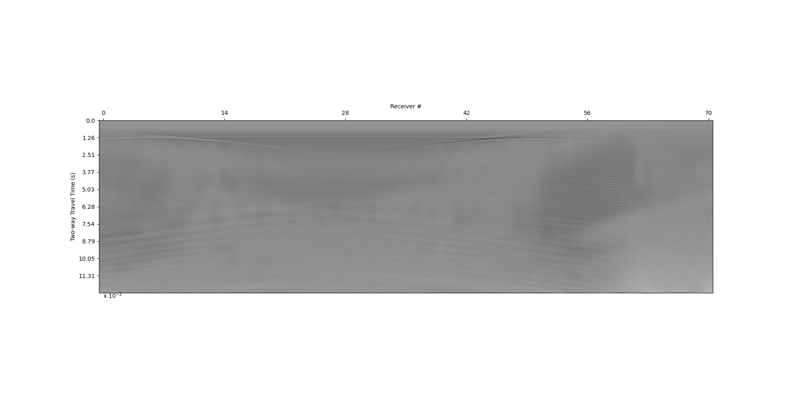

Examples
#############################

The following are small, simple models to introduce the routines.

Shapes model: create a 2.5D animation of wave propagation
**********************************************************

.. _example1:

    The model domain for the "shapes" example.

#. Open a terminal and change directories into the EXAMPLES>shapes folder. Input into the command line::

    prjbuild -i shapes.png -o shapes.prj

#. Using a text editor to modify ``shapes.prj``, add values to the appropriate lines below the header to match the following::

    I,shapes.png
    D,dim,2.5
    D,nx,300
    D,ny,3
    D,nz,100
    D,dx,1
    D,dy,1
    D,dz,1
    D,cpml,20
    D,nmats,3
    D,tfile,10

    # number, id, R/G/B, Temperature, Attenuation, Density, Porosity, Water_Content, Anisotropic, ANG_File
    M,0,ice1h,120/152/76,-20,2,917,0,0,FALSE,
    M,1,water,220/220/220,-20,2,1000,0,0,FALSE,
    M,2,granite,255/75/75,-20,2,2700,0,0,FALSE,

    # The source parameters for the seismic model
    S,dt,
    S,time_steps,400
    S,x,150
    S,y,1
    S,z,0
    S,f0,60
    S,theta,0
    S,phi,0

    # id, C11, C12, C13, C22, C23, C33, C44, C55, C66, rho
    C,0,,,,,,,,,,
    C,1,,,,,,,,,,
    C,2,,,,,,,,,,

    # The source parameters for the electromagnetic model

    E,dt,
    E,time_steps,400
    E,x,150
    E,y,1
    E,z,0
    E,f0,1e8
    E,theta,0
    E,phi,0

    # id, e11, e22, e33, s11, s22, s33
    P,0,,,,,,,,,,
    P,1,,,,,,,,,,
    P,2,,,,,,,,,,

All lines that start with a ``#`` are commented lines.
For reference, you can use the RGB values to identify the materials.

After filling in the domain and material values, save the .prj file, then run the command::

    prjrun shapes.prj -m n

If you look at the prj file now, you will see that the dt lines and the stiffness and permittivity tensors are filled in.
Even though we have all the required fields entered, the model didn't
perform any wave propagation calculations because we used the ``-m n`` option. The ``-m n`` step is required to prepare the file
to calculate the sourcefunction (next step).

Before we can do the wave propagation calculations, we need to generate a source function::

    sourcefunction -p shapes.prj -S gaus0 -m b -a 10

Now you can run the model (both seismic and electromagnetic)::

    prjrun shapes.prj -m s
    prjrun shapes.prj -m e

When that is finished let's build the vti files to view the wavefield.
Starting with the seismic wavefield, enter::

    vtkbuild -p shapes.prj -c Ex -n 20

This should produce a set of vti files identical to the ones in the folder "shapes_ex1_vti". This is a short animation, but the steps for a larger one are the same.

Fill model: create a single shot seismogram and wiggleplot
**********************************************************

.. _example2:
.. figure:: ../EXAMPLES/fill2.png
    :align:   center

    The model domain for the "fill" example.

#. Open a terminal and change directories into the EXAMPLES>fill folder.
We have already created and completed a .prj file for this example ('fill.prj'). As you can see from the materials,
we have set it up to be a granite bedrock (blue) overlain by a subglacial (teal for ice) lake (red for water). We have also created a file listing the locations of the source and receiver
(spaced every 2 m along the surface) from x=50 to x=190 meters.

#. Run the model::

    prjrun -p fill.prj -m s

#. Build the csv file containing the receiver timeseries::

    arraybuild -p fill.prj -c Vx -r receivers.xyz

#. Display the results::

    rcxdisplay -p fill.prj -f receiver_array.csv -g 700 -e 0.02

#. Play with the gain and exaggeration to vary the image to your liking.

#. To make a wiggleplot::

    wiggleplot -p fill.prj -g 5 -r receiver_array.csv -c Vx -x 2 -d 1 -n 5

Fill model: create a common offset radar profile
************************************************

#. Using the same model as before, run it, this time with common offset::

    common_offset -p fill.prj -o 1 0 0 -r receivers.xyz

#. The receiver timeseries are automatically generated, so you can directly display the results::

    rcxdisplay -p fill.prj -f Ex.co.csv  -g 100 -e 0.02

    You should get something like this:

.. _example3:

    A common offset survey across the 'fill' example.

Play with the gain and exaggeration to vary the image to your liking.

`Back to top ↑ <#top>`_
